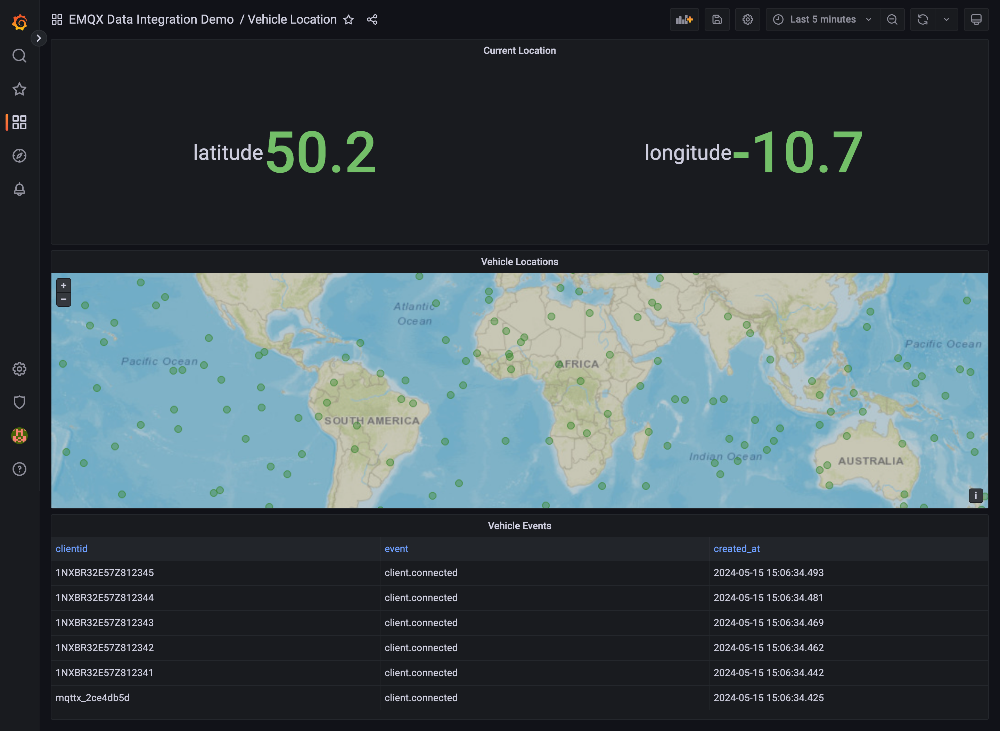

# mqtt-to-postgresql

Ingesting Vehicle data into PostgreSQL by using EMQX PostgreSQL Integration

## Introduction

This tutorial will show you how to use EMQX to ingest Vehicle location data into PostgreSQL. We will use the [EMQX](https://www.emqx.io/) MQTT broker to publish and subscribe to messages and [PostgreSQL](https://www.postgresql.org/) database to store the data.

The scenario of this demo is based on vehicle location, enabling remote monitoring of real-time vehicle location. It utilizes Grafana to provide corresponding real-time and historical vehicle location.This enables real-time monitoring and historical analysis of vehicle location. You can add more types of vehicle data in practice based on it.



**Why PostgreSQL?**

PostgreSQL, a robust open-source relational database system, excels in storing and managing structured data with advanced features for efficient data retrieval and manipulation. Its support for diverse data types, indexing, and query optimization makes it a preferred choice for applications requiring reliable data storage and access. Additionally, PostgreSQL's extensibility and support for geospatial data management through the PostGIS extension further enhance its capabilities, making it suitable for a wide range of use cases.

With PostgreSQL, organizations benefit from a versatile and scalable solution that ensures data integrity and performance. Its customizable nature allows for tailored configurations to meet specific requirements, while its reliability and advanced features make it a dependable option for managing data across various industries. By leveraging PostgreSQL's strengths, businesses can effectively store, query, and analyze data, driving informed decision-making and enhancing overall operational efficiency.

## Architecture


| Name      | Version | Description                                                                      |
| --------- | ------- | -------------------------------------------------------------------------------- |
| [EMQX Enterprise](https://www.emqx.com/en/products/emqx)      | 5.0.3+  | MQTT broker used for message exchange between MQTT clients and the PostgreSQL. |
| [MQTTX CLI](https://mqttx.app/cli) | 1.9.3+  | Command-line tool used to generate simulated data for testing.        |
| [PostgreSQL](https://www.postgresql.org/)     | 13+  | A database for storing and managing vehicle data, as well as providing time aggregation and analysis capabilities for Grafana.          |
| [Grafana](https://grafana.com/)   | 9.5.1+  | Visualization platform utilized to display and analyze the collected data.       |

## How to use

1. Please make sure you have installed the [docker](https://www.docker.com/), and then running the following commands to start the demo:

  ```bash
  docker-compose up -d
  ```

  > You can quickly init submodule and start the demo by using the `make` command as well.

2. Running the following commands to see the message from MQTTX:

  ```bash
  docker logs -f mqttx
  ```

3. If you want to view the vehicle location data in Grafana dashboard, you can open <http://localhost:3000> in your browser, and login with `admin:public`.

## License

[Apache License 2.0](./LICENSE)
